# Evidências da execução

Todas as evidências estão em [`evidencias/`](../evidencias) e foram geradas em 06/10/2026 pelo script [`scripts/capturar-evidencias.mjs`](../scripts/capturar-evidencias.mjs). Para gerar de novo: `npm run evidencias`.

- `evidencias/screenshots/`: telas da interface (página inteira, 1280 px). O nome começa pelo ID do cenário.
- `evidencias/api/`: um JSON por chamada, com data/hora, requisição (método, rota, corpo) e resposta (status e corpo).

Além disso, cada execução da automação gera um relatório HTML com screenshot de todos os testes (`npx playwright show-report`) e trace dos testes que falham.

## Bugs

### BUG-01: frete cobrado com subtotal exatamente R$ 200,00
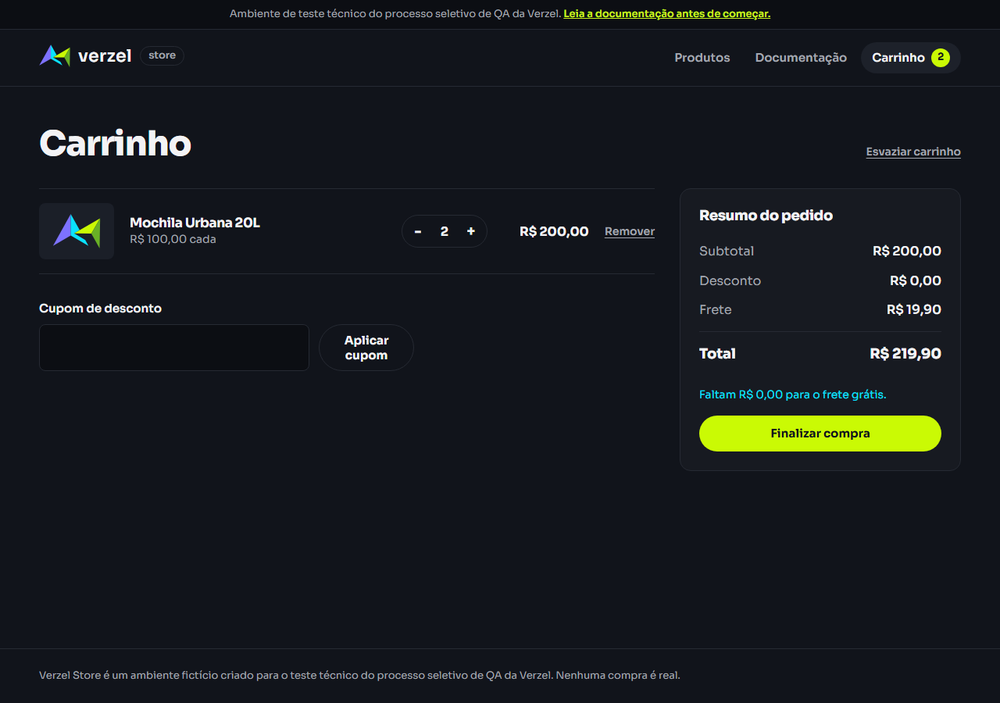

Resposta da API ([JSON completo](../evidencias/api/CT14-BUG01-calcular-subtotal-200_00.json)):
```json
{ "subtotal": 200, "desconto": 0, "frete": 19.9, "freteGratis": false, "valorFaltanteFreteGratis": 0, "total": 219.9 }
```

### BUG-02: mais de 5 unidades aceitas pela API
Carrinho com 8 unidades: aparece o aviso de limite, mas "Finalizar compra" continua ativo.

Pedido confirmado com 8 unidades:
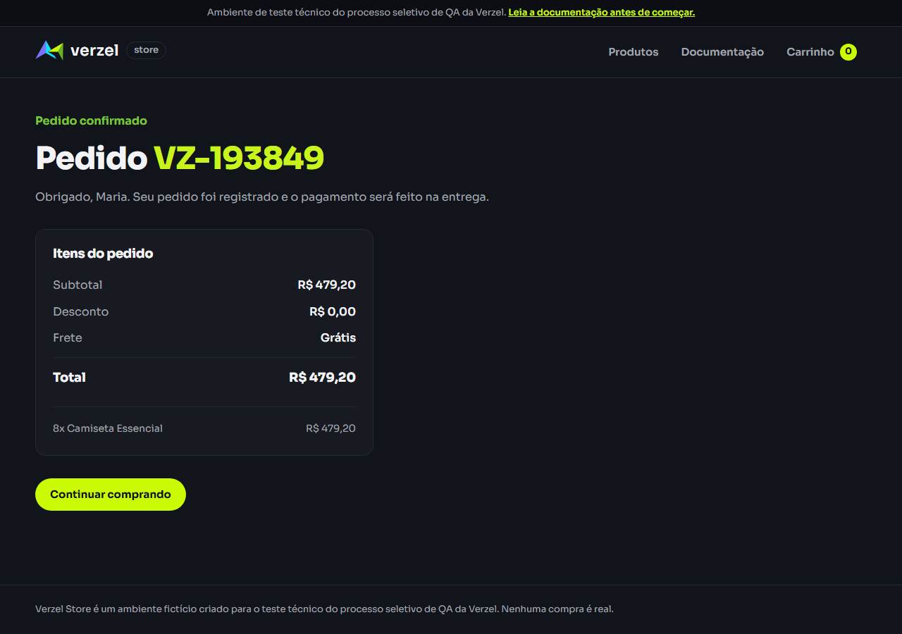

`POST /api/pedidos` com 6 unidades responde **201** ([JSON](../evidencias/api/CT24-BUG02-pedido-quantidade-6.json)), e `POST /api/carrinho/calcular` responde **200** ([JSON](../evidencias/api/CT23-BUG02-calcular-quantidade-6.json)).

### BUG-03: cupom expirado da sessão exibido como aplicado
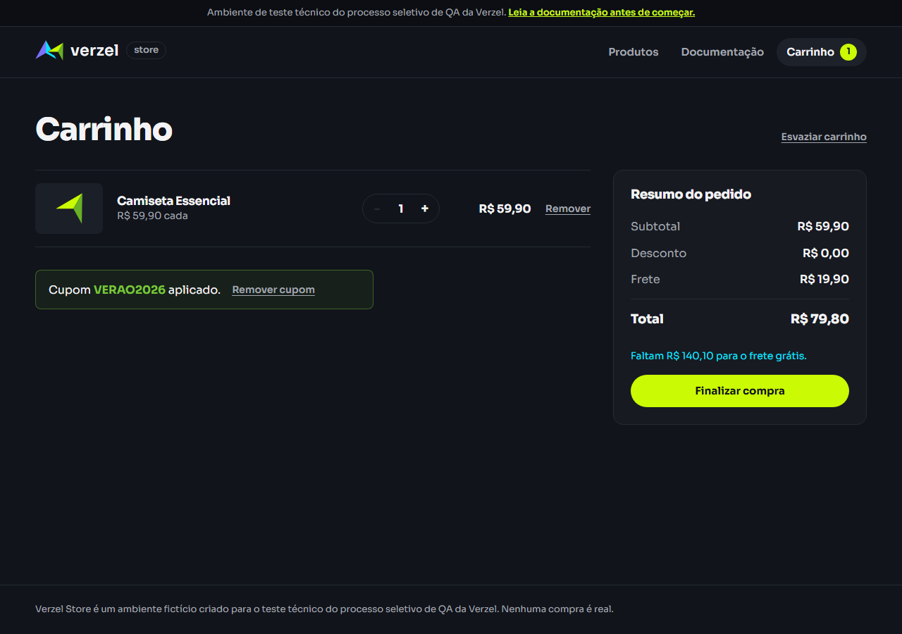


## Cenários que passaram

| Cenário | Evidência |
|---|---|
| CT36: vitrine com os 8 produtos | 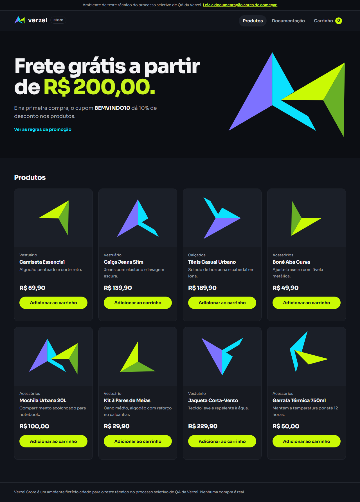 |
| CT01/02/03: `"  bemvindo10 "` aplicado com 10% | 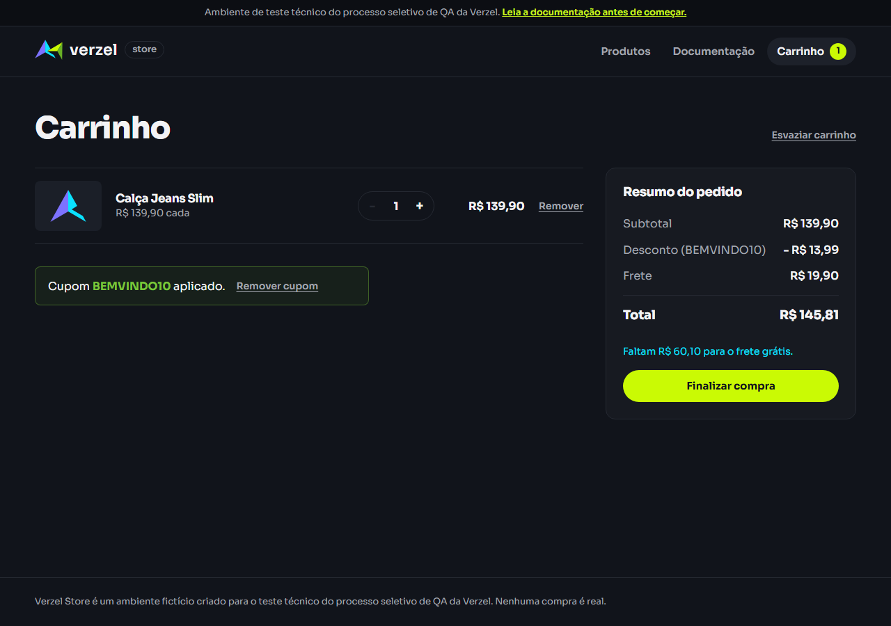 |
| CT04: cupom inexistente |  |
| CT05: cupom expirado | 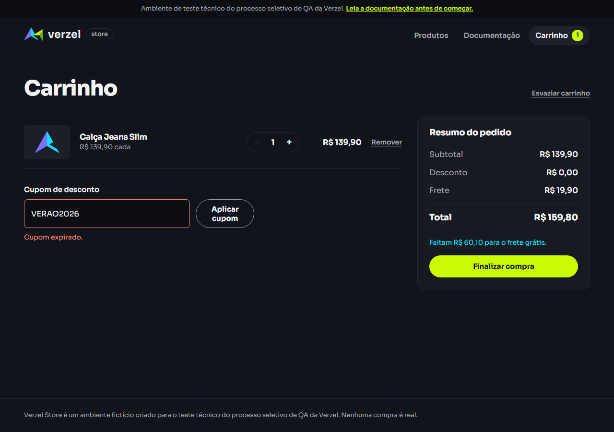 |
| CT06: cupom vazio |  |
| CT08: cupom removido |  |
| CT13: R$ 199,90 → frete cobrado, faltam R$ 0,10 | 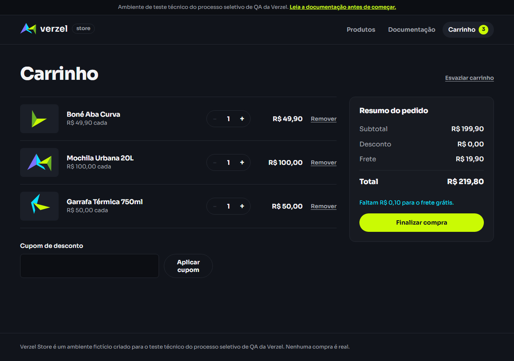 |
| CT15: R$ 219,80 → frete grátis | 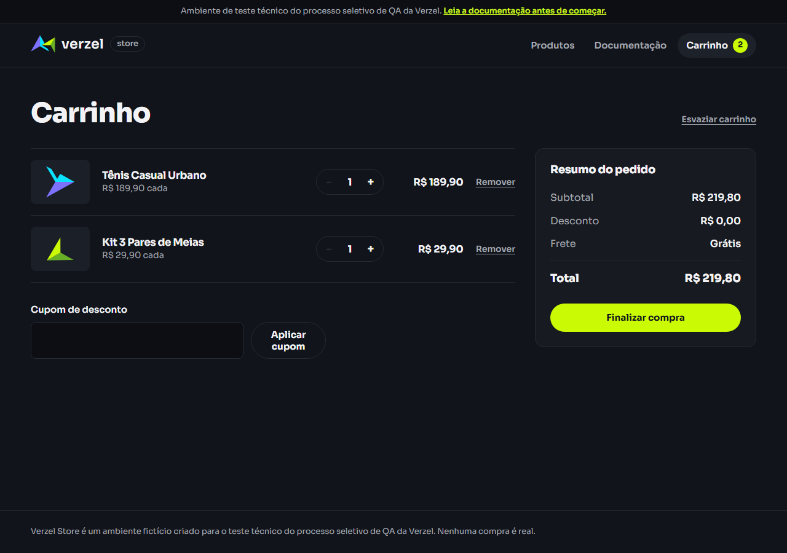 |
| CT18: frete grátis mantido com cupom (total R$ 197,82) | 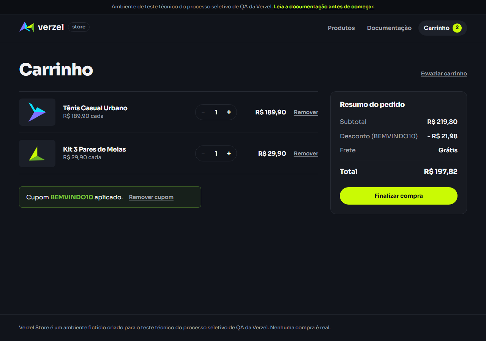 |
| CT20: desconto não incide no frete | 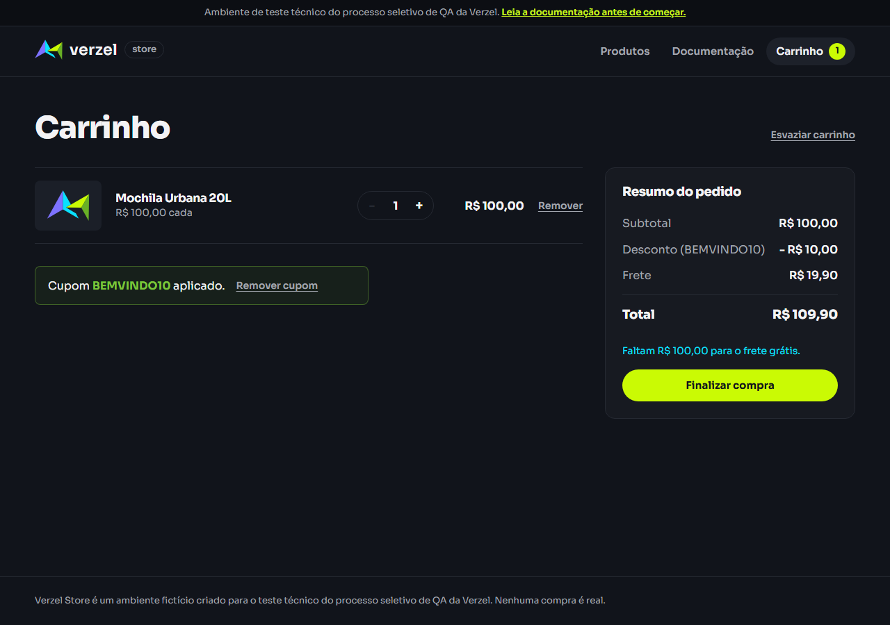 |
| CT21: limite de 5 na vitrine |  |
| CT22: botão "+" desabilitado com 5 | 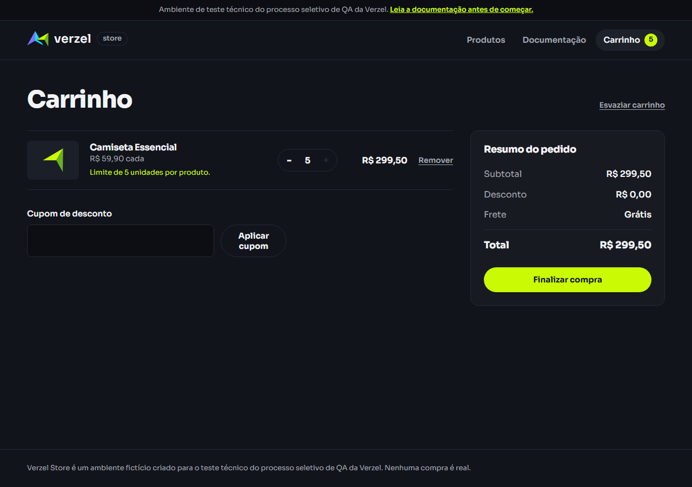 |
| CT37: checkout com campos vazios | 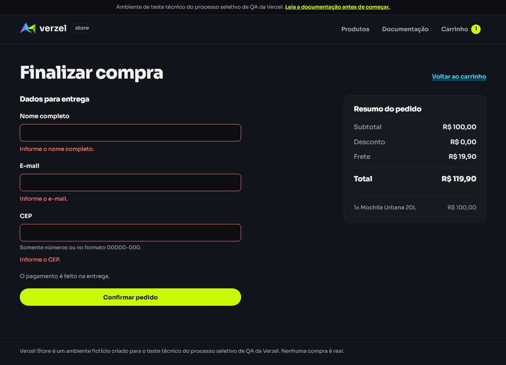 |
| CT38/39/40: dados inválidos |  |
| CT41: pedido confirmado | 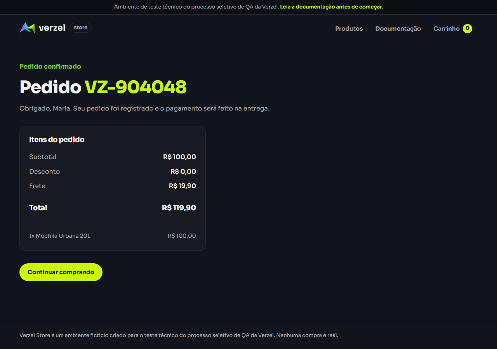 |
| CT41: carrinho vazio depois do pedido |  |
| EX04: nova aba começa com o carrinho vazio (esperado) |  |
| EX05: página não encontrada |  |
| EX06: checkout com o carrinho vazio |  |

## Chamadas de API registradas

| Arquivo | Status |
|---|---|
| [CT01-calcular-cupom-valido](../evidencias/api/CT01-calcular-cupom-valido.json) | 200 |
| [CT02-calcular-cupom-minusculo](../evidencias/api/CT02-calcular-cupom-minusculo.json) | 200 |
| [CT03-calcular-cupom-espacos](../evidencias/api/CT03-calcular-cupom-espacos.json) | 200 |
| [CT04-calcular-cupom-inexistente](../evidencias/api/CT04-calcular-cupom-inexistente.json) | 200 |
| [CT05-calcular-cupom-expirado](../evidencias/api/CT05-calcular-cupom-expirado.json) | 200 |
| [CT10-pedido-cupom-inexistente](../evidencias/api/CT10-pedido-cupom-inexistente.json) | 422 |
| [CT11-pedido-cupom-expirado](../evidencias/api/CT11-pedido-cupom-expirado.json) | 422 |
| [CT13-calcular-subtotal-199_90](../evidencias/api/CT13-calcular-subtotal-199_90.json) | 200 |
| [CT14-BUG01-calcular-subtotal-200_00](../evidencias/api/CT14-BUG01-calcular-subtotal-200_00.json) | 200 ❌ |
| [CT14-BUG01-calcular-subtotal-200_00-combinado](../evidencias/api/CT14-BUG01-calcular-subtotal-200_00-combinado.json) | 200 ❌ |
| [CT14-BUG01-pedido-subtotal-200_00](../evidencias/api/CT14-BUG01-pedido-subtotal-200_00.json) | 201 ❌ |
| [CT15-calcular-subtotal-219_80](../evidencias/api/CT15-calcular-subtotal-219_80.json) | 200 |
| [CT18-calcular-frete-antes-do-desconto](../evidencias/api/CT18-calcular-frete-antes-do-desconto.json) | 200 |
| [CT20-calcular-desconto-nao-incide-frete](../evidencias/api/CT20-calcular-desconto-nao-incide-frete.json) | 200 |
| [CT23-BUG02-calcular-quantidade-6](../evidencias/api/CT23-BUG02-calcular-quantidade-6.json) | 200 ❌ (esperado 422) |
| [CT24-BUG02-pedido-quantidade-6](../evidencias/api/CT24-BUG02-pedido-quantidade-6.json) | 201 ❌ (esperado 422) |
| [CT25-calcular-quantidade-5](../evidencias/api/CT25-calcular-quantidade-5.json) | 200 |
| [CT26-calcular-quantidade-0](../evidencias/api/CT26-calcular-quantidade-0.json) | 422 |
| [CT26-calcular-quantidade-decimal](../evidencias/api/CT26-calcular-quantidade-decimal.json) | 422 |
| [CT27-calcular-arredondamento](../evidencias/api/CT27-calcular-arredondamento.json) | 200 |
| [CT29-json-invalido](../evidencias/api/CT29-json-invalido.json) | 400 |
| [CT30-rota-inexistente](../evidencias/api/CT30-rota-inexistente.json) | 404 |
| [CT31-metodo-nao-permitido](../evidencias/api/CT31-metodo-nao-permitido.json) | 405 |
| [CT32-itens-vazios](../evidencias/api/CT32-itens-vazios.json) | 422 |
| [CT33-item-invalido](../evidencias/api/CT33-item-invalido.json) | 422 |
| [CT34-produto-inexistente-calcular](../evidencias/api/CT34-produto-inexistente-calcular.json) | 422 |
| [CT34-produto-inexistente-get](../evidencias/api/CT34-produto-inexistente-get.json) | 404 |
| [CT35-item-duplicado](../evidencias/api/CT35-item-duplicado.json) | 422 |
| [CT36-listar-produtos](../evidencias/api/CT36-listar-produtos.json) | 200 |
| [CT41-pedido-valido](../evidencias/api/CT41-pedido-valido.json) | 201 |
| [CT42-pedido-dados-invalidos](../evidencias/api/CT42-pedido-dados-invalidos.json) | 422 |
